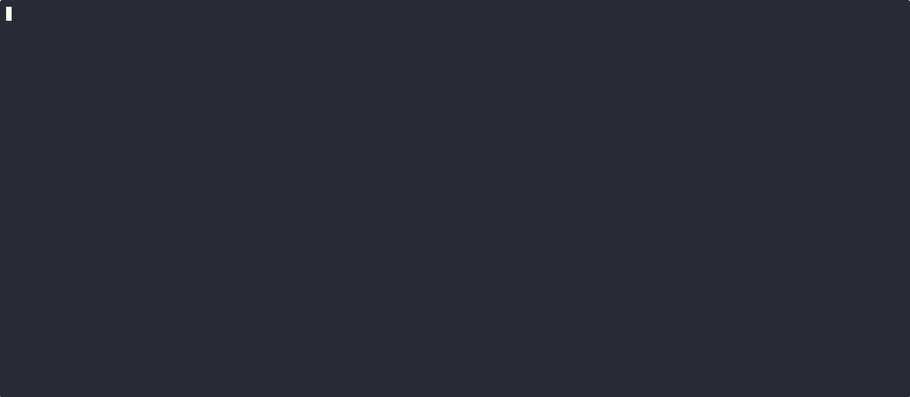

<p align="center">
  
</p>

<h1 align="center">claude-teams-brain</h1>

<p align="center">
  <strong>Persistent memory for Claude Code Agent Teams</strong><br>
  Your AI teammates remember what they built last session.
</p>

<p align="center">
  <a href="LICENSE"></a>
  
  
  <a href="https://claude.ai/claude-code"></a>
</p>

---

<!-- TODO: Replace with your recorded GIF -->
<p align="center">
  
</p>

---

## The Problem

Agent Teams are powerful — but **ephemeral**. Every teammate spawns blank. Your backend agent spent two hours learning your conventions and building auth. Tomorrow, a new backend agent starts from zero.

Meanwhile, a single `npm test` dumps 20,000 tokens of passing tests into context.

## The Fix

claude-teams-brain hooks into the Agent Teams lifecycle to:

- **Remember everything** — tasks, decisions, files, all indexed per role
- **Inject memory automatically** — when `backend` spawns, it receives everything past backend agents did
- **Filter command output** — 60+ command-aware filters cut token usage by 90–97%

No extra prompting. No manual context. Your team gets smarter every session.

## Install

**One command:**

```bash
npx claude-teams-brain
```

Or with curl:

```bash
bash <(curl -fsSL https://raw.githubusercontent.com/Gr122lyBr/claude-teams-brain/master/claude-teams-brain/scripts/install.sh)
```

Then restart Claude Code.

> **Optional:** Enable Agent Teams in `~/.claude/settings.json`:
> ```json
> { "env": { "CLAUDE_CODE_EXPERIMENTAL_AGENT_TEAMS": "1" } }
> ```
> Without this, the plugin runs in **solo mode** — memory still builds from your own sessions.

## How It Works

```
Session 1                              Session 2
─────────                              ─────────
You: "Build payments module"           You: "Add refund support"

  backend agent spawns (blank)           backend agent spawns
  ↓                                      ↓
  builds Stripe integration              🧠 Brain injects memory:
  creates controller.ts                    • Past work: Stripe integration
  decides: use PaymentIntents API          • Files: controller.ts, stripe.service.ts
  ↓                                        • Decision: use PaymentIntents API
  🧠 Brain indexes everything              • Rule: all endpoints need auth
                                           ↓
                                         picks up exactly where it left off
```

### Output Filtering

Every command through the brain's MCP tools is filtered before entering context:

| Command | Before | After | Savings |
|---------|--------|-------|---------|
| `git push` | Transfer stats, compression, deltas | `ok main` | **98%** |
| `npm install` | Warnings, progress bars, funding | `added 542 packages in 12s` | **90%+** |
| `pytest` (all pass) | Full session output | `15 passed in 2.34s` | **82%** |
| `npm test` | 20,000 tokens of passing tests | Summary + failures only | **90%+** |

60+ commands supported. Raw output is always preserved in the searchable KB — only the filtered version enters context.

## Quick Start

**Existing repo:**
```
/brain-learn
```
Scans your git history and auto-extracts conventions, architecture, file coupling, and hotspots. Zero config.

**New project:**
```
/brain-seed nextjs-prisma
```
Loads pre-built conventions. Profiles: `nextjs-prisma`, `fastapi`, `go-microservices`, `react-native`, `python-general`.

**Then just use Agent Teams normally.** Memory builds automatically.

## Commands

| Command | Description |
|---------|-------------|
| `/brain-learn` | Auto-learn conventions from git history |
| `/brain-remember <text>` | Store a rule injected into all future teammates |
| `/brain-forget <text>` | Remove a stored memory |
| `/brain-search <query>` | Search the brain knowledge base |
| `/brain-query <role>` | Preview what context a teammate would receive |
| `/brain-export` | Export knowledge as `CONVENTIONS.md` |
| `/brain-stats` | Full stats: memory + KB + filter savings |
| `/brain-runs` | List past sessions |
| `/brain-replay [run-id]` | Replay a past session as narrative |
| `/brain-update` | Pull latest version |

## Key Features

| | |
|---|---|
| **Cross-session memory** | Indexes tasks, decisions, and files per role across sessions |
| **Output filtering** | 60+ command-aware filters, 8-stage pipeline, specialized parsers |
| **Auto-learn** | `/brain-learn` bootstraps the brain from your git history |
| **Session KB** | `batch_execute` auto-indexes output into searchable knowledge base |
| **Solo mode** | Works without Agent Teams — memory builds from your own sessions |
| **Fully local** | SQLite, no cloud, no telemetry, zero external Python dependencies |
| **Cross-platform** | macOS, Linux, WSL2, native Windows — all hooks run via Python |

## Architecture

All data is local in `~/.claude-teams-brain/projects/<hash>/brain.db` (SQLite + FTS5).

7 lifecycle hooks capture everything → role-based memory → ranked + deduplicated → injected within a 3000-token budget.

For full technical details, MCP tool reference, and troubleshooting, see the **[full documentation](docs/DOCUMENTATION.md)**.

## License

MIT
